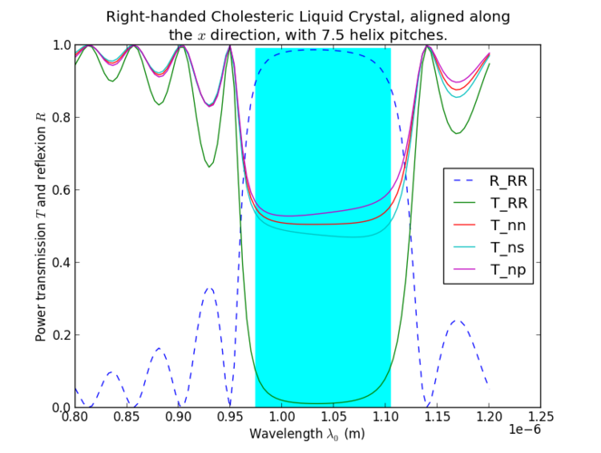

Berreman4x4
======
A Python implementation of D.W. Berreman's 4x4 matrix method.

Code, [documentation](http://github.com/downloads/Berreman4x4/Berreman4x4/documentation.pdf) and examples are available on the GitHub [project page](http://github.com/Berreman4x4/Berreman4x4).

You can browse through the project page or download the repository with the command `git clone git://github.com/Berreman4x4/Berreman4x4.git`.

Example of simulation result:

